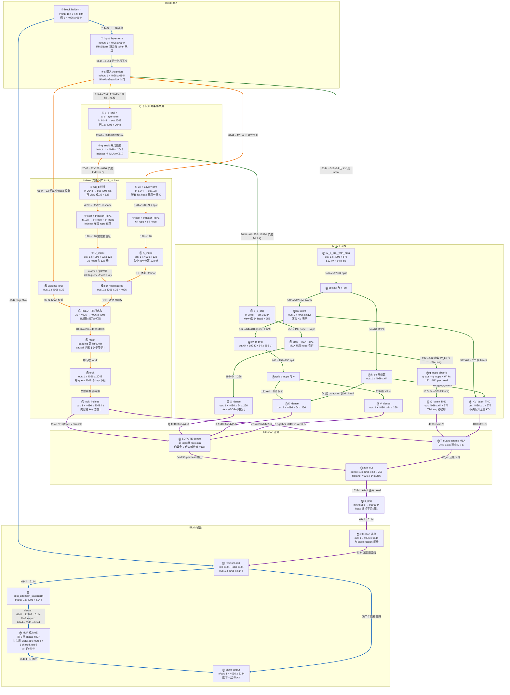

# GLM-5.2 DSA / MLA 技术附录

> **主文**：[GLM-5.2-技术汇报.md](./GLM-5.2-技术汇报.md)  
> **代码入口**：`nemo_automodel/components/models/glm_moe_dsa/layers.py`

---

## 1. MLA 基础资料

建议有相关的基础(**MHA->MLA**)

如果对 MLA 本身不熟，建议先看这两篇，再继续看后面的矩阵流水；如果已经理解 DeepSeek MLA，可以直接跳过。

| 资料 | 链接 |
|------|------|
| 了解 MLA：MLA | <https://zhuanlan.zhihu.com/p/19585986234> |
| MLA 计算流全图解 & 吸收矩阵对比分析 | <https://zhuanlan.zhihu.com/p/1954817905456808453> |

---

## 2. 读图方式

- **节点**：算子名 → `in → out` shape → 示例数值（B=1, S=4096）
- **箭头文字**：这一步做什么 + 维度怎么变
- **线条颜色**：蓝=Block，黄=Q 下投影，橙=Indexer，绿=MLA，紫=Attention
- `GlmMoeDsaMLA.forward()` 收到的 `x` 已是 `input_layernorm(h)`；完整 Block 还包括 attention residual、`post_attention_layernorm`、MLP/MoE residual。

一句话版：

```text
Indexer 负责选 key 位置，MLA 负责在这些位置上做低秩 attention。
两者共享 q_resid 起点，但 Indexer 的 K 和 MLA 的 KV 是两条不同支路。
```

---

## 3. 完整数据流图



---

## 4. 按颜色读主线

| 颜色 | 起点 | 维度变化链 | 最终产出 |
|------|------|------------|----------|
| 蓝 | `h` skip + `attn_out` | `6144 + 6144 → 6144`（残差）→ dense MLP / MoE → 再残差 | 下一层 Block 输入 |
| 黄 | `x` | `6144 → 2048`（q_a）→ `2048`（q_resid） | 供 Indexer / MLA 共用的 Q 低秩表示 |
| 橙 | `x` + `q_resid` | `6144 → 128`（K_index）+ `2048 → 32×128`（Q_index）→ 打分 `4096×4096` → topk | `topk_indices [1,4096,2048]` 整数位置 |
| 绿 | `x` + `q_resid` | `6144 → 512+64`（KV 压缩）+ `2048 → 64×256`（Q_mla）→ dense 展开 K/V 或 TileLang latent | `Q/K/V` 或 `Q_latent/KV_latent` |
| 紫 | `topk_indices` + MLA 输出 | topk → mask / gather → `64×256` head 输出 → `16384 → 6144` | `attn_out [1,4096,6144]` |

**Indexer vs MLA 的 Q 别混**：同源 `q_resid [1,4096,2048]`，但 Indexer 走 `wq_b → 32×128`，MLA 走 `q_b_proj → 64×256`；Indexer 的 K 来自 `wk(x)` 而非 MLA 的 K。

---

## 5. 关键维度

| 类别 | 参数 | 值 |
|------|------|----|
| 输入 | hidden_size | 6144 |
| Q 低秩 | q_lora_rank | 2048 |
| KV 低秩 | kv_lora_rank | 512 |
| MLA | num_attention_heads | 64 |
| MLA | qk_nope_head_dim | 192 |
| MLA | qk_rope_head_dim | 64 |
| MLA | qk_head_dim | 256 |
| MLA | v_head_dim | 256 |
| Indexer | index_n_heads | 32 |
| Indexer | index_head_dim | 128 |
| Indexer | index_topk | 2048 |

> HF config 中有 `head_dim=192` 字段；画 MLA 主路时应以 `qk_head_dim=256 = 192 + 64` 为准。

---

## 6. 分支解释

### 6.1 Indexer 支路

```text
q_resid [B,S,2048]
  → wq_b
  → Q_index [B,S,32,128]

x [B,S,6144]
  → wk + LayerNorm
  → K_index [B,S,128]

Q_index @ K_index^T
  → scores [B,S,S]
  → topk_indices [B,S,2048]
```

`topk_indices` 是整数位置编号，表示每个 query 可以看的 key 位置集合。

### 6.2 MLA 支路

```text
q_resid [B,S,2048]
  → q_b_proj
  → Q_mla [B,S,64,256]

x [B,S,6144]
  → kv_a_proj_with_mqa
  → kv_latent [B,S,512] + k_pe [B,S,64]
```

Dense 路径会通过 `kv_b_proj` 展开完整 `K/V`；TileLang 路径会在 latent 空间按 topk 做 sparse MLA。

---

## 7. Dense / SDPA 与 TileLang 路径

| 路径 | 计算方式 | 适用 |
|------|----------|------|
| Dense / SDPA | 展开 `K_dense/V_dense`，用 topk mask 屏蔽非选中位置 | smoke、短序列、排障 |
| TileLang sparse MLA | `q_nope` 吸收到 latent 维度，直接 gather selected latent | 长上下文、正式 recipe |

TileLang 关键形态：

```text
q_nope [T,64,192]
  → absorb W_kc
  → q_absorbed [T,64,512]
  → concat q_pe [64]
  → Q_latent [T,64,576]

kv_latent [T,512] + k_pe [T,64]
  → KV_latent [T,1,576]
```

---

## 8. 代码对应

| 概念 | 代码位置 / 名称 |
|------|-----------------|
| Block | `nemo_automodel/components/models/glm_moe_dsa/model.py::Block` |
| Attention | `GlmMoeDsaMLA` |
| Indexer | `GlmMoeDsaIndexer` |
| Q 低秩支路 | `q_a_proj`、`q_a_layernorm`、`q_b_proj` |
| KV latent 支路 | `kv_a_proj_with_mqa`、`kv_a_layernorm`、`kv_b_proj` |
| Dense sparse mask | `_build_sparse_mask` |
| TileLang sparse MLA | `tilelang_sparse_attention` |
| IndexShare | `indexer_types`、`skip_topk`、`prev_topk_indices` |

---

## 9. 容易讲错的点

| 误区 | 正确口径 |
|------|----------|
| `topk=2048` 是选 2048 个维度 | 是选 2048 个 key 位置 |
| DSA 替代 attention | DSA 只选位置，MLA 才做 attention |
| Indexer K 就是 MLA K | 两条支路，投影不同 |
| Indexer head 数应等于 MLA head 数 | Indexer 是 32 heads，MLA 是 64 heads |
| `head_dim=192` 就是 MLA QK head | MLA 主路应看 `qk_head_dim=256` |
